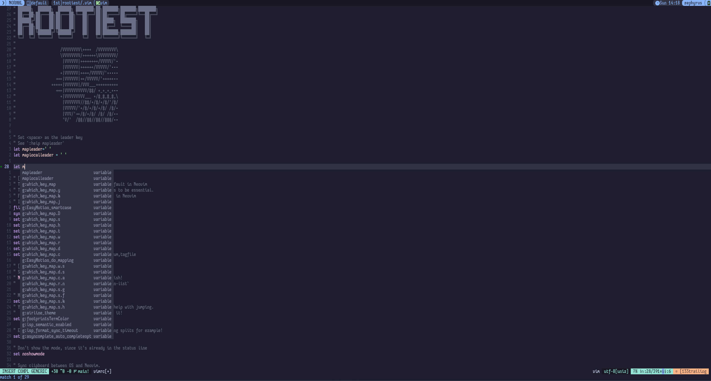

# Rootiest Vim Configuration

```none
██████╗  ██████╗  ██████╗ ████████╗██╗███████╗███████╗████████╗
██╔══██╗██╔═══██╗██╔═══██╗╚══██╔══╝██║██╔════╝██╔════╝╚══██╔══╝
██████╔╝██║   ██║██║   ██║   ██║   ██║█████╗  ███████╗   ██║   
██╔══██╗██║   ██║██║   ██║   ██║   ██║██╔══╝  ╚════██║   ██║   
██║  ██║╚██████╔╝╚██████╔╝   ██║   ██║███████╗███████║   ██║   
╚═╝  ╚═╝ ╚═════╝  ╚═════╝    ╚═╝   ╚═╝╚══════╝╚══════╝   ╚═╝   
                                                               
                /VVVVVVVV\++++  /VVVVVVVV\
                \VVVVVVVV/++++++\VVVVVVVV/
                 |VVVVVV|++++++++/VVVVV/'
                 |VVVVVV|++++++/VVVVV/'
                +|VVVVVV|++++/VVVVV/'+
              +++|VVVVVV|++/VVVVV/'+++++
            +++++|VVVVVV|/VVV___++++++++++
              +++|VVVVVVVVVV/##/ +_+_+_+
                +|VVVVVVVVV___ +/#_#,#_#,\
                 |VVVVVVV//##/+/#/+/#/'/#/
                 |VVVVV/'+/#/+/#/+/#/ /#/
                 |VVV/'++/#/+/#/ /#/ /#/
                 'V/'  /##//##//##//###/
```

The rootiest vim configuration you will ever see!

## Installation

1. Install [Vim](https://www.vim.org/)
2. Install Pre-requisites
3. Backup your current vim configuration (if you have one)

   ```sh
   mv ~/.vim ~/.vim.bak
   mv ~/.vimrc ~/.vimrc.bak
   ```

4. Clone the repository

   ```sh
   git clone git@github.com:rootiest/rootiest-vim ~/.vim
   ```

5. Open a new Vim session and run `:PluginInstall`

6. Enjoy! 🎉

## Features

- Comfortable keybindings and IDE-like features
- Convenience keymappings to match with [rootiest-nvim](https://github.com/rootiest/rootiest-nvim)
- Catppuccin Mocha theme
- Lightweight and designed for portability.
- Simply copy the vimrc file to any remote server to use it there.

## Screenshot



## Companion Tools

[Rootiest WezTerm](https://github.com/rootiest/rootiest-wezterm) -
A wezterm configuration that is designed to work with this Vim configuration.

[Rootiest Kitty](https://github.com/rootiest/rootiest-kitty) -
A kitty configuration that is designed to work with this Vim configuration.

[Rootiest Fish](https://github.com/rootiest/rootiest-fish-conf) -
A fish configuration that pairs well with this Vim configuration.

[Rootiest Tmux](https://github.com/rootiest/rootiest-tmux) -
A tmux configuration that is designed to work with this Vim configuration.

[Rootiest Neovim](https://github.com/rootiest/rootiest-nvim) -
A NeoVim configuration built to work alongside this and the fish configuration.

[Rootiest Iosevka Font](https://github.com/rootiest/rootiest-iosevka) -
A custom Iosevka font that is designed by developers, for developers.

[Nerd Fonts](https://github.com/ryanoasis/nerd-fonts/) -
A collection of fonts that includes many icons and glyphs used in this configuration.

## Dotfiles

[Rootiest Dotfiles](https://github.com/rootiest/dotfiles)

## Credits

- [Folke Lamaitre](https://github.com/folke)
- [LazyVim](https://github.com/LazyVim/LazyVim)
- [Elijah Manor](https://github.com/elijahmanor/elijahmanor)
